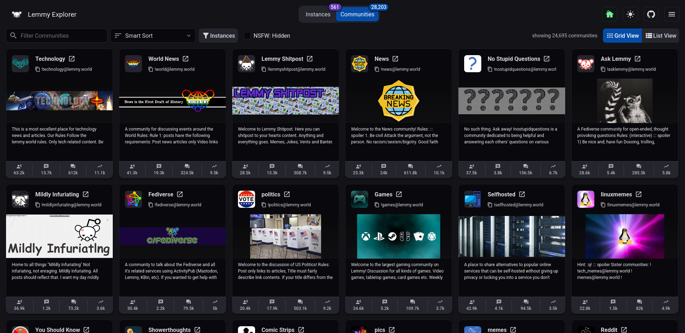

 

# Lemmy Explorer https://lemmyverse.net/

> Note: Deployment has been moved to [GitHub pages](https://github.com/tgxn/lemmyverse.net), as S3 charges were coming up on USD $20/mo.

Data Dumps: https://data.lemmyverse.net/

This project provides a simple way to explore Lemmy Instances and Communities.

This project now supports multiple fediverse projects. Use the branding drop-down in the left header to switch between them.

## Supported Platforms

These are the platforms that are currently supported by this project:

| Software | URL Path              |
| -------- | --------------------- |
| Lemmy    | `/`                   |
| MBin     | `/mbin/magazines`     |
| Piefed   | `/piefed/communities` |

## Project Structure

The project consists of the following modules:

| Module Description                            | Path        | Readme                         |
| --------------------------------------------- | ----------- | ------------------------------ |
| Crawler _(NodeJS, Redis)_                     | `/crawler`  | [README](./crawler/README.md)  |
| Frontend _(ReactJS, MUI Joy, TanStack)_       | `/frontend` | [README](./frontend/README.md) |
| Deployment _(Amazon CDK v2)_                  | `/cdk`      | [README](./cdk/README.md)      |
| Data Dump Site _(ReactJS, MUI, GitHub Pages)_ | `/pages`    | [README](./pages/README.md)    |

Each module has its own README with more details.

## FAQ

## Q: How can I set a link to automatically set the home instance?

You can append `home_url` and (optionally) `home_type` to the URL to set the home instance and type.

`?home_url=lemmy.example.com`
`?home_url=mbin.example.com&home_type=mbin`

> `home_type` supports "lemmy" and "mbin" (default is "lemmy")

### Q: **How does discovery work?**

It uses a [seed list of communities](https://github.com/tgxn/lemmy-explorer/blob/main/crawler/src/lib/const.ts#L68) and scans the equivalent of the `/instances` federation lists, and then creates jobs to scan each of those servers.

Additionally, instance tags and trust data is fetched from [Fediseer](https://gui.fediseer.com/).

### Q: **How does the NSFW filter work?**

The NSFW filter is a client-side filter that filters out NSFW communities and instances from results by default.
The "NSFW Toggle" checkbox has thress states that you can toggle through:

| State      | Filter       | Value |
| ---------- | ------------ | ----- |
| Default    | Hide NSFW    | false |
| One Click  | Include NSFW | null  |
| Two Clicks | NSFW Only    | true  |

When you try to switch to a non-sfw state, a popup will appear to confirm your choice. You can save your response in your browsers cache and it will be remembered.

### Q: **How long till my instance shows up?**

How long it takes to discover a new instance can vary depending on if you post content that's picked up by one of these servers.

Since the crawler looks at lists of federated instances, we can't discover instances that aren't on those lists.

Additionally, the lists are cached for 24 hours, so it can take up to 24 hours for an instance to show up after it's been discovered till it shows up.

### Q: **Can I use your data in my app/website/project?**

I do not own any of the data retrieved by the crawler, it is available from public endpoints on the source instances.

You are free to pull data from the GitHub pages site:

[**Lemmyverse Data Site**](https://data.lemmyverse.net/)

**Please don't hotlink the files on the public website `https://lemmyverse.net/`**

### Q: **How often is the data updated?**

Currently, I upload a Redis dump generated by the crawler each night to s3, GitLab builds the JSON dump from that.

You can download [Latest ZIP](https://data.lemmyverse.net/data/json-bundle.zip) from the [data site](https://data.lemmyverse.net/).

`json-bundle.zip` file contains all the data in JSON format:

- `communities.full.json` - list of all communities
- `instances.full.json` - list of all instances
- `overview.json` - metadata and counts

- many other files with more detailed data

## Awesome Lemmy Links

### General

- https://join-lemmy.org/instances
- https://github.com/maltfield/awesome-lemmy-instances

### Lemmy Stats Pages

- https://lemmy.fediverse.observer/dailystats
- https://the-federation.info/platform/73
- https://fedidb.org/software/lemmy
- https://fedidb.org/current-events/threadiverse

### Thanks / Related Lemmy Tools

- https://github.com/db0/fediseer
- https://github.com/LemmyNet/lemmy-stats-crawler

# Credits

- Logo made by Andy Cuccaro (@andycuccaro) under the CC-BY-SA 4.0 license.
- Lemmy Developers and Community for creating [Lemmy](https://github.com/LemmyNet).
